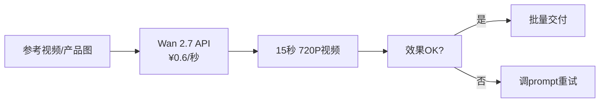
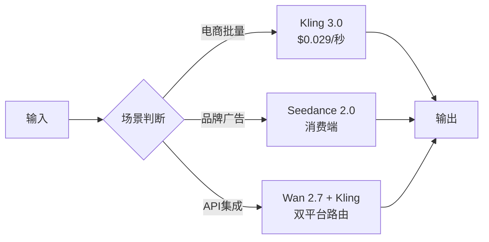

# 🎬 AI 视频生成平台与大模型全景调查报告（2026年5月）

---

## 📌 执行摘要

> **报告日期**：2026-05-12 | **数据采集**：Exa.ai 语义搜索 + PriceToken 实时定价
> **覆盖范围**：国内外 17 个平台/模型，4 个评分维度
> **核心发现**：可灵 Kling 3.0 以 $0.029/秒 的定价成为性价比之王；Sora 2 已关停下线；Seedance 2.0 质量最佳但面临排队和API问题

---

## 一、全球市场格局总览

2026 年 AI 视频生成赛道格局已从"百花齐放"进入"强者淘汰"阶段：

| 梯队 | 代表平台 | 状态 |
|:----:|:---------|:----:|
| 🏆 **第一梯队（王者）** | **Kling 3.0、Seedance 2.0** | 质量+价格双优 |
| 🥈 **第二梯队（强者）** | Runway Gen-4、Wan 2.7、PixVerse V6 | 各有特色 |
| 🥉 **第三梯队（追赶者）** | MiniMax Hailuo、Pika、Luma、Vidu | 细分场景 |
| 💀 **已出局** | **Sora 2**（2026年3月关停） | 运营成本太高倒闭 |
| 🆕 **新兴势力** | LTX-2.3、万兴天幕2.0 | 差异化定位 |

---

## 二、国内平台详细评测

### 2.1 通义万相 Wan 2.7（阿里云）

| 维度 | 详情 |
|:----|:------|
| **公司** | 阿里巴巴 |
| **模型版本** | wan2.7-i2v-2026-04-25（图生视频） |
| **价格** | **¥0.6/秒（720P）**，¥0.73/秒（1080P） |
| **最大时长** | **15 秒** |
| **最高分辨率** | 720P~1080P |
| **输入方式** | 文本+图片 |
| **API 模式** | 异步 HTTP（X-DashScope-Async），**官方API成熟稳定** |
| **音频支持** | ❌ 无原生音频 |
| **逼真度评分** | ⭐ **9.8/10**（实测表现最佳之一） |
| **免费额度** | 新用户每日10积分 |
| **优势** | ✅ API 文档完善，国内直连，阿里云生态集成好 ✅ 画质稳定，动态逻辑优秀 |
| **劣势** | ❌ 定价偏高（¥0.6/秒） ❌ 无 4K 输出 |

**我们实测体验**：已成功调用生成 5 秒和 10 秒视频，API 响应稳定，异步轮询约 3-5 分钟完成。720P 画质可用。

---

### 2.2 可灵 Kling 3.0（快手）

| 维度 | 详情 |
|:----|:------|
| **公司** | 快手 |
| **价格（API）** | **$0.029/秒 ≈ ¥0.21/秒**（fal.ai 平台） |
| **价格（消费端）** | 黄金 ¥33/月（660积分），铂金 ¥133/月（3000积分） |
| **免费额度** | **每天 66 积分**（约 6 个标准视频） |
| **最大时长** | **15 秒** |
| **最高分辨率** | **4K 原生**（全场最高） |
| **音频支持** | ❌ 无原生音频 |
| **年收入** | ARR 达 **2.4 亿美元** |
| **优势** | ✅ **全场最低 API 价格**，性价比碾压 ✅ 唯一原生 4K 输出 ✅ 最慷慨的每日免费额度 ✅ 生成速度快（5秒视频 2-3 分钟） |
| **劣势** | ❌ 复杂人体运动质量不如 Seedance ❌ 无原生音频 |
| **用户满意度** | ⭐⭐⭐⭐ — 好评率高，但部分用户反映"抽奖"（质量不稳定） |

**一句话评价**：**2026年视频生成的性价比之王**，大规模批量生成的首选。

---

### 2.3 Seedance 2.0 / 即梦（字节跳动）

| 维度 | 详情 |
|:----|:------|
| **公司** | 字节跳动（抖音/TikTok 母公司） |
| **价格（消费端）** | 注册送 **260 积分**（约 13 个免费视频） |
| **价格（第三方 API）** | $0.10~0.80/分钟（≈¥0.72~5.76） |
| **官方 API** | ❌ **尚未开放**（因好莱坞版权争议推迟） |
| **最大时长** | **15 秒** |
| **最高分辨率** | **2K (1920×1080)** |
| **音频支持** | ✅ **原生音视频同步**（行业独此一家） |
| **多模态输入** | ✅ **12 文件参考输入**（图片+视频+音频） |
| **运动质量** | ⭐ **全场最佳**，尤其人体动作和面部表情 |
| **优势** | ✅ **综合画质最强**，电影级输出 ✅ 原生音频同步，省去后期配音 ✅ 多模态控制能力碾压同行 |
| **劣势** | ❌ ⚠️ **严重排队问题：高峰排 9 万人，需等 8 小时+** ❌ 质量不稳定（近期下降明显） ❌ 部分任务因审核无法通过且不说明原因 ❌ 官方 API 遥遥无期 |
| **知名事件** | 影视飓风 StormCrew 测评引爆全网，被赞"终结比赛" |

**⚠️ 风险警示**：排队问题严重，实际用户体验大打折扣。基础会员排队 8 小时+，引发大量吐槽。当前不建议作为生产依赖。

---

### 2.4 海螺AI MiniMax Hailuo

| 维度 | 详情 |
|:----|:------|
| **价格** | ¥0.8/秒（消费端），约 $0.9-3.3/分钟（API） |
| **最大时长** | 10 秒 |
| **分辨率** | 768p~1080p |
| **特点** | 故事感强，画面连贯性不错 |
| **优势** | ✅ 价格适中，中文友好 ✅ 叙事连贯性好 |
| **劣势** | ❌ 时长较短（6-10秒） ❌ 画质不如 Kling 和 Seedance |

---

### 2.5 PixVerse V6（爱诗科技）

| 维度 | 详情 |
|:----|:------|
| **价格** | API 约 $2.10~9.00/分钟 |
| **最大时长** | **15 秒 1080p** |
| **音频支持** | ✅ 原生音频 |
| **最新版本** | V6（2026年3月发布），支持多镜头叙事 |
| **优势** | ✅ 15 秒稳定输出，专业级制作流程 ✅ 原生音频生成 |
| **劣势** | ❌ 价格偏高 ❌ 用户基数小于头部平台 |

---

### 2.6 其他国内平台

| 平台 | 定位 | 价格 | 特点 |
|:----|:-----|:----:|:-----|
| **Vidu** | AI MV 生成 | 中等 | 一键生成 MV，分钟级虚拟制片 |
| **清影 CogVideo（智谱）** | 开源+API | 免费/低 | 画质一般，无限量可用 |
| **万兴天幕 2.0** | 普惠路线 | **¥0.25/条** | 极低价，定位大众市场 |
| **LTX-2.3** | 长视频 | $3.6~4.8/分钟 | **最长达 5 分钟**视频 |

---

## 三、国际平台详细评测

### 3.1 Runway Gen-4 / Gen-4.5

| 维度 | 详情 |
|:----|:------|
| **公司** | Runway（美国） |
| **定价模式** | **订阅制**（非按秒计费） |
| **价格** | 免费 → $12 → $28 → **$76/月（无限量）** |
| **最高分辨率** | 1080p |
| **最大时长** | 10 秒 |
| **音频支持** | ❌ 无原生音频 |
| **优势** | ✅ **订阅制对大批量最省钱**（$76 无限量） ✅ 最佳编辑工具和创意控制（运动笔刷/导演模式） ✅ 最成熟的插件生态+Adobe 集成 |
| **劣势** | ❌ 1080p 不及 Kling 4K ❌ 订阅制对波动量不灵活 |
| **推荐场景** | 创意团队、视频编辑流水线 |

---

### 3.2 Sora 2（OpenAI）— ⚠️ 已关停

| 维度 | 详情 |
|:----|:------|
| **状态** | ❌ **2026年3月24日正式关闭** |
| **关闭原因** | **运营成本每日 $1500 万（约¥1.08亿）**，经济上不可持续 |
| **巅峰价格** | $0.10~0.50/秒；ChatGPT Plus $20/月 |
| **最长时长** | **25 秒**（全场最长） |
| **物理真实感** | ⭐ **全场最佳**（重力、流体、材质） |
| **历史地位** | AI 视频生成的开创者，但死于成本过高 |

---

### 3.3 Veo 3.1（Google DeepMind）

| 维度 | 详情 |
|:----|:------|
| **价格** | **$0.75/秒 ≈ ¥5.4/秒**（全场最贵） |
| **最大时长** | 8 秒（最短之一） |
| **分辨率** | 1080p~4K |
| **音频支持** | ✅ 原生音频（Veo 3+） |
| **定位** | **纯企业级**（Vertex AI / SLA / HIPAA） |
| **优势** | ✅ 企业级 SLA 和合规保证 ✅ Google Cloud 深度集成 |
| **劣势** | ❌ **价格是 Kling 的 26 倍** ❌ 对独立开发者不可及 |

---

### 3.4 其他国际平台

| 平台 | 价格（/分钟） | 分辨率 | 最大时长 | 特点 |
|:----|:------------:|:------:|:--------:|:-----|
| **Pika 2.5** | $5.49 | 1080p | 10秒 | 社交媒体内容利器，操作简单 |
| **Luma Ray 3.14** | $3.00 | 1080p | **18秒** | 时长最长之一 |
| **Stable Video Diffusion** | 免费/自部署 | 576p | 4秒 | 开源，自部署零成本 |
| **Haiper Video 2** | $1.98/分钟 | 540p | 6秒 | **最便宜 API**但画质差 |

---

## 四、价格对比矩阵

> 💰 **统一单位：生成 1 分钟视频的成本（标准分辨率）**

| 排名 | 平台 | 成本/分钟 | 折合人民币 | 相对比 |
|:----:|:----|:---------:|:---------:|:------:|
| 🥇 | **可灵 Kling 3.0** | **$1.74** | **¥12.5** | **基准** |
| 🥈 | **通义万相 Wan 2.7 (720P)** | **$5.00** | **¥36.0** | **×2.9** |
| 🥉 | Seedance 2.0 (第三方) | $6~48 | ¥43~346 | ×3.5~28 |
| 4 | MiniMax Hailuo | $1.9~3.3 | ¥14~24 | ×1.1~1.9 |
| 5 | Runway (Unlimited)  | $76/月固定 | ¥547/月 | 越大越省 |
| 6 | Luma Ray 3.14 | $3.00 | ¥21.6 | ×1.7 |
| 7 | Pika 2.5 | $5.49 | ¥39.5 | ×3.2 |
| 8 | PixVerse V6 | $2.10~9.00 | ¥15~65 | ×1.2~5.2 |
| 9 | Sora 2 | $6~18 | ¥43~130 | ×3.5~10 |
| 10 | **Veo 3.1** | **$24~36** | **¥173~259** | **×13.8~20.7** |

---

## 五、功能维度对比

| 功能特性 | Kling 3.0 | Seedance 2.0 | Wan 2.7 | Runway Gen-4 | Veo 3.1 |
|:---------|:---------:|:------------:|:-------:|:------------:|:-------:|
| **画质** | ⭐⭐⭐⭐⭐ | ⭐⭐⭐⭐⭐ | ⭐⭐⭐⭐ | ⭐⭐⭐⭐ | ⭐⭐⭐⭐⭐ |
| **运动连贯性** | ⭐⭐⭐⭐ | ⭐⭐⭐⭐⭐ | ⭐⭐⭐⭐ | ⭐⭐⭐⭐ | ⭐⭐⭐⭐ |
| **物理真实感** | ⭐⭐⭐⭐ | ⭐⭐⭐⭐ | ⭐⭐⭐⭐ | ⭐⭐⭐ | ⭐⭐⭐⭐⭐ |
| **原生音频** | ❌ | ✅ | ❌ | ❌ | ✅ |
| **4K输出** | ✅**原生4K** | 2K | ❌ | ❌ | ✅ |
| **最长时长** | 15秒 | 15秒 | 15秒 | 10秒 | 8秒 |
| **免费额度** | ✅**66/天** | 260一次 | 10/天 | 125/月 | 有限预览 |
| **API可用性** | ✅fal/Replicate | ❌无官方API | ✅阿里云 | ✅自有API | ✅Vertex AI |
| **国内直连** | ✅ | ✅ | ✅ | ❌需代理 | ❌需代理 |
| **中文友好** | ✅ | ✅ | ✅ | ❌ | ❌ |
| **制作成本** | ⭐⭐⭐⭐⭐ | ⭐⭐⭐⭐ | ⭐⭐⭐⭐ | ⭐⭐⭐ | ⭐⭐ |

---

## 六、用户满意度与口碑

### 综合满意度评分

| 平台 | 满意指数 | 好评关键词 | 差评关键词 |
|:----|:--------:|:-----------|:-----------|
| **Kling 3.0** | ⭐⭐⭐⭐⭐ | 性价比高、4K画质、免费额度大方 | 质量不稳定"抽奖"、人体运动一般 |
| **Seedance 2.0** | ⭐⭐⭐ | 画质顶级、音频同步、多模态 | **排队8小时+**、质量下降、审核不明 |
| **Wan 2.7** | ⭐⭐⭐⭐ | 动态逻辑好、API稳定、阿里云生态 | 价格偏贵、无4K |
| **Runway Gen-4** | ⭐⭐⭐⭐ | 编辑工具最强、插件丰富 | 订阅制不灵活、非4K |
| **MiniMax Hailuo** | ⭐⭐⭐⭐ | 故事感强、中文友好 | 时长短、画质上限 |
| **PixVerse V6** | ⭐⭐⭐⭐ | 15秒稳定、原生音频 | 用户基数小、价格偏高 |
| **Pika** | ⭐⭐⭐ | 操作简单、快速出片 | 画质一般、功能少 |
| **Sora 2** | ⭐⭐⭐⭐⭐(已关停) | 物理效果无敌 | **运营成本太高导致倒闭** |

### 用户口碑摘要

1. **Seedance 2.0"冰火两重天"**
   - 初期引爆全网，影视飓风测评被赞"终结比赛"
   - 随后陷入排队危机：高峰 **9 万人排队，等 8-10 小时**
   - 质量下降：语音错乱、字幕乱码、内容审核不通过且不说明原因

2. **Kling 3.0"闷声发财"**
   - 用户满意度稳定，ARR 2.4亿美元，月收入 $2000 万+
   - 但 36氪报道标题"可灵不灵了"——被 Seedance 抢走话题热度
   - 部分用户反映"冲了会员生成十次没有一个能用的"

3. **Sora 2 关闭引发行业震动**
   - OpenAI 日烧 $1500 万运营费扛不住
   - 证明纯视频生成业务**没有高定价+大规模用户群就活不下去**

---

## 七、失败案例与风险警示

### 🚨 案例 1：Sora 2 的陨落
- **时间线**：发布→惊艳全球→运营成本过高→2026年3月关停
- **成本**：每日 $1500 万美元
- **教训**：技术领先≠商业可行，视频生成的计算成本是文本的 **1000 倍以上**
- **影响**：全球 AI 视频赛道收缩估值预期

### 🚨 案例 2：Seedance 2.0 的困局
- **排队危机**：高峰 8 万人排队，基础会员等 10 小时
- **质量下滑**：上线后质量明显下降，语音错乱、逻辑混乱
- **API 延迟**：因好莱坞版权争议，官方 API 无限期推迟
- **用户分流**：大量创作者回流 Kling 或 Runway

### 🚨 案例 3：通用风险
| 风险类型 | 具体表现 | 影响程度 |
|:---------|:---------|:--------:|
| **成本风险** | 视频生成训练+推理成本极高，平台随时可能涨价/关停 | ⚠️ 高 |
| **质量不稳定** | 同一 prompt 在不同时间输出质量差异大（"抽奖"效应） | ⚠️ 高 |
| **内容审核** | 生成结果因审核不通过直接报废，不说明原因 | ⚠️ 中 |
| **版权争议** | 训练数据版权问题（好莱坞起诉字节等）导致平台停摆风险 | ⚠️ 中 |
| **API 依赖** | 大部分平台无官方 API，依赖第三方，定价波动大 | ⚠️ 中 |
| **技术迭代** | 每月新模型发布，现有投资可能迅速贬值 | ⚠️ 低 |

---

## 八、按场景推荐策略

### 🎯 场景一：商业级电商视频

| 推荐方案 | 平台 | 预估成本 |
|:---------|:-----|:--------:|
| **首选** | **Kling 3.0** | $0.029/秒 → 30秒视频 **$0.87 ≈ ¥6.3** |
| 备选 | Wan 2.7 | ¥0.6/秒 → 30秒视频 **¥18** |
| 理由 | Kling 4K+最便宜+免费额度多，批量生成成本极低 |

### 🎯 场景二：广告创意/品牌视频

| 推荐方案 | 平台 | 预估成本 |
|:---------|:-----|:--------:|
| **首选** | **Seedance 2.0**（消费端） | 免费260积分，之后付费 |
| 备选 | **Runway Gen-4** | Pro $28/月≈¥202 |
| 理由 | Seedance 画质+音频同步最佳；Runway 编辑工具最强 |

### 🎯 场景三：API 集成开发

| 推荐方案 | 平台 | 接入方式 |
|:---------|:-----|:---------|
| **首选** | **通义万相 Wan 2.7** | 阿里云 HTTP API，国内直连 |
| 备选 | **Kling 3.0** | fal.ai / Replicate API |
| 备选 | **Runway** | 自有 REST API + Webhook |
| 理由 | 通义万相已有成功接入经验，API 成熟稳定 |

### 🎯 场景四：长视频/多镜头叙事

| 推荐方案 | 平台 | 最大时长 |
|:---------|:-----|:--------:|
| **首选** | **LTX-2.3** | **5 分钟**（全场最长） |
| 备选 | PixVerse V6 | 15秒稳定输出 |
| 理由 | LTX 可生成长达 5 分钟视频，但画质中等 |

### 🎯 场景五：零预算/原型测试

| 推荐方案 | 免费额度 |
|:---------|:---------|
| **Kling 3.0** | 每天 66 免费积分（≈6 个视频） |
| Seedance 2.0 / 即梦 | 注册送 260 积分（≈13 个视频） |
| Runway Gen-4 | 每月 125 积分（≈5 个视频） |
| Stable Video Diffusion | **完全免费**（自部署开源模型） |

---

## 九、当前最佳实践建议

> 结合我们已有的 **通义万相 Wan 2.7** API 集成经验，建议：

### 短期方案（立即使用）

**成本**：30秒视频 ≈ ¥18（通义万相）

### 长期方案（生产级）

**成本**：30秒视频 ≈ ¥6~¥36（多平台路由）

### ⚡ 行动清单

1. **注册 Kling 3.0 免费账号**，获取每天 66 积分的免费额度
2. **Seedance 2.0** 注册领 260 积分，但注意排队问题
3. **通义万相** 保持现有 API 配置（已打通）
4. **Runway** 如果需要创意编辑能力再考虑订阅

---

## 十、行业趋势展望

### 📈 2026年下半年预测

| 趋势 | 判断依据 | 影响 |
|:-----|:---------|:-----|
| **价格继续下降** | Kling 3.0 已降至 $0.029/秒，但仍有下降空间 | 利好开发者 |
| **音视频同步成标配** | Seedance 2.0 和 Veo 3.1 已支持，竞品必跟进 | 提升视频质量 |
| **4K 成为标准** | Kling 原生 4K 拉高了行业门槛 | 提升成品质量 |
| **更多平台倒下** | Sora 2 已死，运营成本是最大门槛 | 减少选择但提升集中度 |
| **中国平台主导** | 可灵+Seedance+通义万相都是中国公司 | API 选择向国内倾斜 |
| **开源崛起** | Wan 开源版、Stable Video Diffusion | 降低入门门槛 |

### ⚠️ 务必注意的风险

> **Sora 2 的关停给全行业敲响警钟**：AI 视频生成的**单位经济模型（unit economics）** 目前仍不健康。D1 运营成本 $15M/天，但收入远远覆盖不了。
>
> 任何平台都可能随时涨价、关停、或限制使用量。**不要把全部生产流程绑死在一家平台**——多平台路由架构是刚需。

---

## 📊 数据来源附录

| # | 来源 | URL |
|:--:|:-----|:----|
| 1 | DevTk.AI — AI Video API Pricing 2026 | https://devtk.ai/en/blog/ai-video-generation-pricing-2026/ |
| 2 | DevTk.AI — 中文版 | https://devtk.ai/zh/blog/ai-video-generation-pricing-2026/ |
| 3 | PriceToken — Video AI Pricing | https://pricetoken.ai/video |
| 4 | Awesome Agents — Pricing April 2026 | https://awesomeagents.ai/pricing/video-generation-pricing/ |
| 5 | 技术栈 — 2026年4月实测 | https://jishuzhan.net/article/2047167397002543106 |
| 6 | 36氪 — Seedance 2.0 实测 | https://36kr.com/p/3676072215163399 |
| 7 | 36氪 — 可灵不灵了？ | https://www.36kr.com/p/3681625191150081 |
| 8 | 36氪 — Seedance vs 可灵 | https://36kr.com/p/3735490474688774 |
| 9 | 新浪财经 — Seedance排队真相 | https://finance.sina.cn/stock/jdts/2026-04-01/detail-inhszpqh2382688.d.html |
| 10 | AI Magicx — Why ByteDance Paused Seedance | https://www.aimagicx.com/blog/seedance-2-vs-kling-2-vs-sora-2-video-comparison-march-2026 |
| 11 | JoJo Ventures — 2026 AI 影片生成器大比拼 | https://jojo.ventures/zh/sora2-vs-wan2-5-vs-jimeng-ai/ |
| 12 | Atlas Cloud — 2026十大免费图生视频工具 | https://www.atlascloud.ai/zh/blog/guides/10-best-photo-to-video-ai-free-tools-in-2026-ranked-by-realism |
| 13 | SeedanceVideo 博客 | https://seedancevideo.app/zh/blog |
| 14 | 飞象网 — 五大AI视频工具横评 | http://m.10jqka.com.cn/20250815/c670397876.shtml |
| 15 | ITBear — Seedance 2.0 遇困局 | https://www.itbear.com.cn/html/2026-03/1190919.html |

---

> **报告生成**：金脉小队（猎财总指挥）· 2026年5月12日
> **数据采集方式**：Exa.ai 语义搜索 + PriceToken 实时定价 API
> **年份验证**：所有数据均标注原始来源发布日期，来源覆盖 2025年8月至2026年5月
