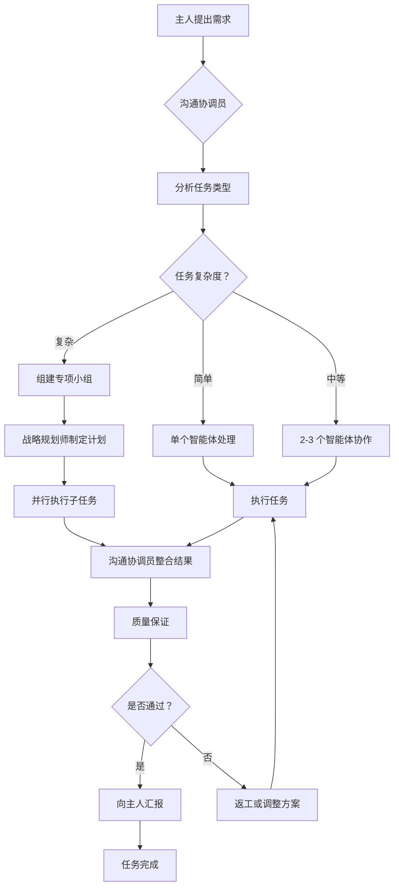

# 🎭 多智能体团队协作框架

## 项目概述

这是一个为 Hermes Agent 构建的专业化多智能体团队系统，包含 10 个不同角色的子智能体，每个都有明确的职责和专业能力。通过协作可以高效完成各种复杂任务。

---

## 👥 团队构成

```
┌─────────────────────────────────────────────────┐
│           🤝 沟通协调员 (Coordinator)            │
│              团队枢纽和主人接口                   │
└──────────────────┬──────────────────────────────┘
                   │
    ┌──────────────┼──────────────┐
    ↓              ↓              ↓
┌────────┐   ┌────────┐    ┌────────┐
│📋战略规划师 │   │🏗️代码架构师 │   │💻实现工程师 │
│(Planning)│   │(Design) │   │(Coding)  │
└────────┘   └────────┘    └────────┘
    ↓              ↓              ↓
┌────────┐   ┌────────┐    ┌────────┐
│🛡️QA 专家 │   │📊研究分析师 │   │📝文档专家 │
│(Testing)│   │(Research)│   │(Docs)   │
└────────┘   └────────┘    └────────┘
    ↓              ↓              ↓
┌────────┐   ┌────────┐    ┌────────┐
│🚀运维师 │   │🔌MCP 专家 │   │🏠生活助理 │
│(DevOps) │   │(Tools)  │   │(Life)   │
└────────┘   └────────┘    └────────┘
```

### 智能体清单

| # | 角色 | 技能名称 | 核心能力 | 适用场景 |
|---|------|---------|---------|---------|
| 1 | 战略规划师 | strategic-planner | 任务分解、计划制定 | 新项目启动、复杂任务规划 |
| 2 | 代码架构师 | code-architect | 系统设计、技术选型 | 架构设计、重构方案 |
| 3 | 实现工程师 | implementation-engineer | 编码开发、单元测试 | 功能实现、Bug 修复 |
| 4 | QA 专家 | qa-specialist | 测试验证、安全审计 | 代码审查、性能测试 |
| 5 | 研究分析师 | research-analyst | 信息搜集、数据分析 | 市场调研、技术研究 |
| 6 | 文档专家 | documentation-specialist | 文档编写、知识管理 | API 文档、用户手册 |
| 7 | 运维师 | devops-engineer | 部署配置、监控告警 | CI/CD 流水线、生产环境 |
| 8 | MCP 专家 | mcp-specialist | 工具集成、API 配置 | 第三方服务对接、自定义工具 |
| 9 | 生活助理 | life-assistant | 日程管理、本地服务 | 日常生活事务、哈尔滨服务 |
| 10 | 沟通协调员 | communication-coordinator | 任务分配、进度追踪 | 项目管理、结果汇报 |

---

## 📖 使用指南

### 快速开始

#### 方式一：在会话中加载单个智能体

```bash
# 进入 Hermes Agent 会话后
/skill strategic-planner
```

或者:

```bash
hermes -s code-architect "请为我设计一个电商系统的架构"
```

#### 方式二：批量加载多个智能体

```bash
hermes -s strategic-planner,code-architect,implementation-engineer \
       "启动一个新的 Web 项目开发"
```

#### 方式三：通过沟通协调员统一管理

```bash
/skill communication-coordinator
```

然后向沟通协调员描述你的需求，它会自动协调其他智能体参与。

### 典型工作流程

#### 场景 1: 完整的项目开发流程

```markdown
步骤 1: 战略规划阶段
├─ 加载：strategic-planner
├─ 输入：项目需求和目标
└─ 输出：详细的执行计划和任务分解

步骤 2: 架构设计阶段  
├─ 加载：code-architect
├─ 输入：规划师输出的计划
└─ 输出：技术方案和架构文档

步骤 3: 并行实施阶段
├─ 加载：implementation-engineer + research-analyst
├─ 分工：工程师写代码，研究员找资料
└─ 协作：定期同步进度

步骤 4: 质量保证阶段
├─ 加载：qa-specialist
├─ 输入：实现的代码
└─ 输出：测试报告和审核意见

步骤 5: 文档整理阶段
├─ 加载：documentation-specialist
├─ 输入：所有阶段的产出
└─ 输出：完整的文档集

步骤 6: 部署上线阶段
├─ 加载：devops-engineer
├─ 输入：代码和部署配置
└─ 输出：运行中的服务

全程跟踪:
└─ 加载：communication-coordinator
    └─ 负责协调所有环节并向主人汇报
```

#### 场景 2: 日常技术支持

```
主人："服务器出现异常响应"

自动触发流程:
1. devops-engineer → 检查系统日志和监控
2. implementation-engineer → 排查代码问题
3. qa-specialist → 复现和验证 Bug
4. communication-coordinator → 汇总诊断结果并汇报
```

#### 场景 3: 生活辅助任务

```
主人："帮我安排明天的行程"

直接调用:
life-assistant → 
  查询天气 + 查看已有日程 + 推荐时间安排 → 
  生成个性化建议
```

---

## 🔧 智能体调度机制

### 基于任务类型的路由规则

```python
from typing import List

TASK_ROUTING_RULES = {
    # 技术类任务
    "project_planning": ["strategic-planner"],
    "system_design": ["code-architect", "research-analyst"],
    "feature_implementation": ["implementation-engineer", "qa-specialist"],
    "code_review": ["qa-specialist", "code-architect"],
    
    # 数据和研究类
    "market_research": ["research-analyst"],
    "data_analysis": ["research-analyst", "mcp-specialist"],
    
    # 运维类
    "deployment": ["devops-engineer", "mcp-specialist"],
    "monitoring_setup": ["devops-engineer"],
    
    # 文档类
    "api_documentation": ["documentation-specialist"],
    "user_guide": ["documentation-specialist", "research-analyst"],
    
    # 生活类
    "schedule_management": ["life-assistant"],
    "local_services": ["life-assistant"],
    
    # 复杂项目（需要多智能体协作）
    "full_stack_project": [
        "strategic-planner",
        "code-architect", 
        "implementation-engineer",
        "qa-specialist",
        "documentation-specialist",
        "devops-engineer"
    ],
    
    # 工具集成项目
    "tool_integration": [
        "mcp-specialist",
        "implementation-engineer",
        "qa-specialist"
    ]
}

def route_task(task_description: str) -> List[str]:
    """根据任务描述决定需要的智能体"""
    # 简化版本：实际应使用更复杂的分类算法
    
    if any(keyword in task_description for keyword in ["计划", "规划", "策略"]):
        return TASK_ROUTING_RULES["project_planning"]
    
    elif any(keyword in task_description for keyword in ["架构", "设计", "技术选型"]):
        return TASK_ROUTING_RULES["system_design"]
    
    elif any(keyword in task_description for keyword in ["编写代码", "实现", "开发"]):
        return TASK_ROUTING_RULES["feature_implementation"]
    
    elif any(keyword in task_description for keyword in ["日程", "安排", "提醒"]):
        return TASK_ROUTING_RULES["schedule_management"]
    
    else:
        # 默认返回沟通协调员让它判断
        return ["communication-coordinator"]
```

---

## 🎯 最佳实践

### 1. 选择合适的智能体数量

**原则**: 不是越多越好，而是刚刚好

| 任务复杂度 | 建议智能体数 | 示例 |
|-----------|------------|------|
| 简单 | 1 个 | 查询信息、单文件修改 |
| 中等 | 2-3 个 | 小功能开发、文档撰写 |
| 复杂 | 4-6 个 | 完整项目开发、系统集成 |
| 超复杂 | 全部 10 个 | 大型产品从 0 到 1 |

### 2. 清晰的职责边界

每个智能体应该:
- **知道自己做什么**: 明确的核心职责
- **知道不做什么**: 避免越界抢活
- **知道何时求助**: 遇到超出能力范围的问题

### 3. 有效的沟通模式

推荐使用以下模板:

```markdown
【任务分配】
主题：[任务标题]
负责人：[@智能体角色]
截止日期：YYYY-MM-DD
验收标准：
- [标准 1]
- [标准 2]

【进度更新】
当前阶段：[阶段名称]
完成情况：[具体成果]
遇到的问题：[如果有]
下一步计划：[接下来的动作]

【成果提交】
交付物：[列表]
质量自检：[自查结果]
需要的反馈：[希望关注的点]
```

### 4. 处理冲突的优先级

当多个智能体的输出有冲突时:

```
质量要求冲突 → 以 QA 专家为准
技术方案冲突 → 以代码架构师为准
时间估算冲突 → 以战略规划师为准  
部署方案冲突 → 以运维师为准
格式规范冲突 → 以文档专家为准
```

### 5. 性能优化技巧

- **并行处理**: 独立的任务让多个智能体同时做
- **缓存复用**: 相同的研究问题只查一次
- **分治策略**: 大任务拆解给多个同类智能体
- **早失败原则**: 发现问题尽早终止错误分支

---

## 📊 团队协作流程图



---

## 🔍 常见问题 FAQ

**Q1: 什么时候需要用多智能体协作？**
A: 当任务涉及多个专业领域、有多个并行可处理的子任务、或者有较高的质量和准确性要求时。

**Q2: 如何确保各智能体不会重复工作？**
A: 沟通协调员负责任务分配和去重，战略规划师提前划分清楚职责边界。

**Q3: 如果某个智能体出错怎么办？**
A: QA 专家会进行验证，发现错误后会标记并要求重新执行，或者由其他智能体补救。

**Q4: 能否自定义新的智能体角色？**
A: 可以！按照现有技能的格式创建新的 SKILL.md 文件即可，只需注意职责不要与现有角色重叠太多。

**Q5: 如何在哈尔滨本地化环境中更好地使用？**
A: 生活助理已经集成了哈尔滨本地服务和特色功能，其他技术类智能体也考虑了东北地区的特殊需求。

---

## 📞 支持与维护

### 问题反馈
如果遇到任何问题或有不合理的地方，请向沟通协调员报告，它会记录并寻求解决方案。

### 持续改进
团队会根据使用反馈不断优化各智能体的能力和协作流程。

---

*版本：1.0.0*  
*最后更新：2026-04-22*  
*维护者：Multi-Agent Team Development Group*
